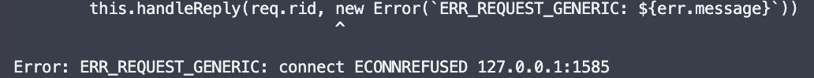
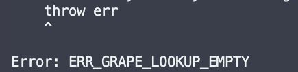

# Findings from grenache-test

### Errors:
**There were some error that I got in the process, so I noted them since I couldn't find several information about it:**

**Client**
-   Reason: This error seems to happen when there is not call for handle reply in the request handling, on the server side.
-   Happened when the client is called very quickly, after close another request, RARE CASE (Maybe can be the setup)

**Client**
-   Reason: seems to happen when the link is not announced with the same name of the rid.
-   This error happens even with grapes server running, and the Links are pointing to the same grape, even changing the port is still failing for the client.

**Server**
- I could not get much information about what was happening.

### To Do:
- Couldn't finish the Service Order Book, the `executeTransaction` is missing, I would work on the updation of the order book of each user, but I would also make a complete wallet for the coin available.
- Improve the logging.
- Sanitaze the data that comes from client.

### Note
I got several issues while trying to test, because the server needed to be ready, I tried to look for an event that let me know when that happened.